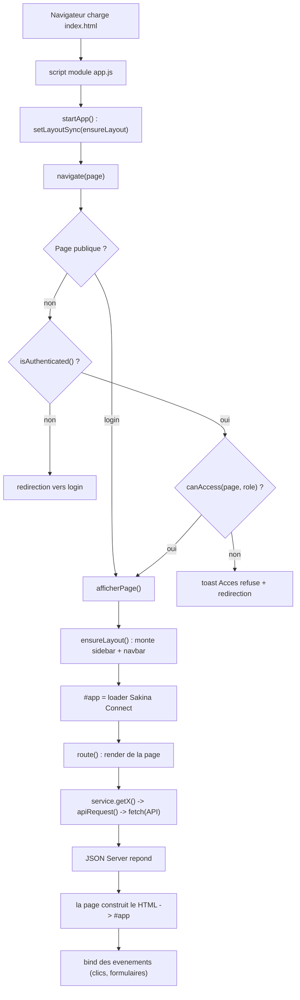
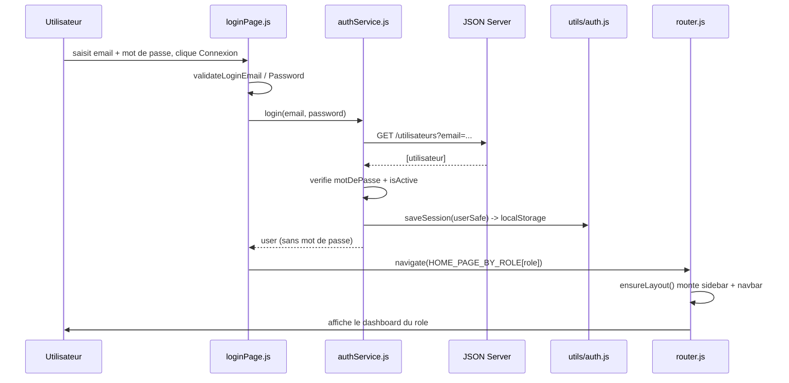
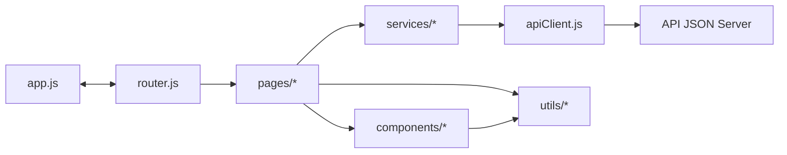
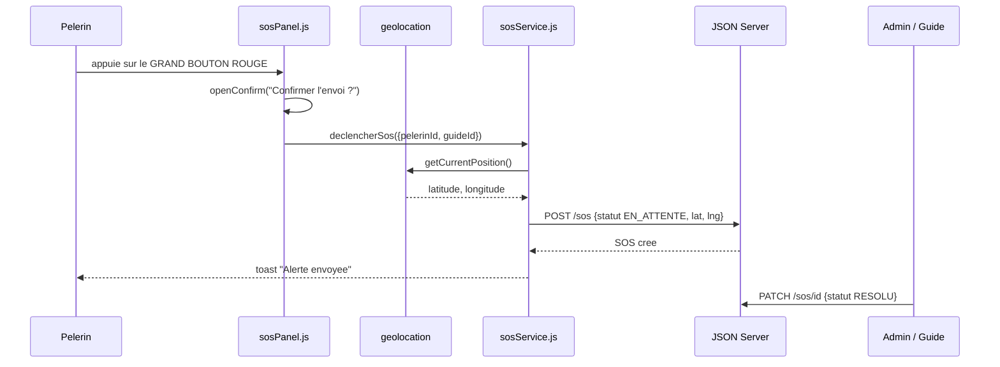

# Sakina Connect — Documentation technique

Plateforme de gestion des voyages **Omra & Hajj** : utilisateurs, guides, pèlerins, proches, groupes, planning, annonces et **alertes SOS**.

Cette documentation explique **comment l'application est construite**, **comment les fichiers communiquent**, et **ce qui se passe — requête par requête — avant qu'une page ne s'affiche**.

---

## Sommaire

1. [Vue d'ensemble & stack](#1-vue-densemble--stack)
2. [Architecture des dossiers](#2-architecture-des-dossiers)
3. [Cycle de vie d'une page](#3-cycle-de-vie-dune-page)
4. [Le login, étape par étape](#4-le-login-étape-par-étape)
5. [La navigation (URL en hash)](#5-la-navigation-url-en-hash)
6. [Comment les fichiers communiquent](#6-comment-les-fichiers-communiquent)
7. [Modèle de données](#7-modèle-de-données)
8. [Rôles & permissions](#8-rôles--permissions)
9. [Fonctionnalités](#9-fonctionnalités)
10. [Le SOS en détail](#10-le-sos-en-détail)
11. [La carte (Leaflet)](#11-la-carte-leaflet)
12. [Soft delete & archives](#12-soft-delete--archives)
13. [Notifications (cloche)](#13-notifications-cloche)
14. [Composants réutilisables](#14-composants-réutilisables)
15. [Lancement du projet](#15-lancement-du-projet)
16. [Décisions & version 2](#16-décisions--version-2)

---

## 1. Vue d'ensemble & stack

Sakina Connect est une **SPA** (Single Page Application) : une seule page HTML (`index.html`) dans laquelle le JavaScript **remplace dynamiquement** le contenu de la zone `#app` selon la navigation. Il n'y a **pas** de rechargement de page entre les écrans.

| Couche | Technologie |
|---|---|
| Front | HTML5 + **Tailwind (CDN)** + **JavaScript (modules ES)**, sans bundler |
| API (dev) | **JSON Server** hébergé sur Render (base = un fichier JSON) |
| Cartes | **Leaflet** + fond **OpenStreetMap** (gratuit, sans clé) |
| Images | **Cloudinary** (upload des photos) |
| Session | `localStorage`, clé `currentUser` |

**Règle d'or de l'architecture :** une *page* ne parle **jamais** directement à l'API. Elle passe par un *service*, qui passe par `apiClient`, qui fait le `fetch`. Cela isole les données de l'affichage et prépare une future migration vers MySQL.

---

## 2. Architecture des dossiers

```
index.html            → structure racine + conteneurs (#app, #sidebarRoot, #navbarRoot, #toast, #modalRoot)
js/
├─ app.js             → point d'entrée : démarre l'app, monte le layout
├─ router.js          → table des routes, permissions, navigation, loader
├─ config/
│  ├─ api.js          → URL de base + ENDPOINTS de l'API
│  └─ roles.js        → ROLES + HOME_PAGE_BY_ROLE
├─ services/          → un fichier par entité : parle à l'API
│  ├─ apiClient.js    → apiRequest() : le fetch central
│  ├─ authService.js  → login / logout
│  ├─ pelerinService.js, guideService.js, groupeService.js, procheService.js…
│  ├─ annonceService.js, sosService.js, planningService.js, categorieService.js…
│  ├─ validationService.js  → unicité email / téléphone / passeport
│  └─ notificationService.js → agrège SOS + annonces pour la cloche
├─ components/        → briques d'UI réutilisables (sans données)
│  ├─ drawer.js, modal.js, toast.js, pagination.js, viewToogle.js
│  ├─ navBar.js, sideBar.js, pageHeader.js, table.js, sosPanel.js, leafletMap.js
├─ pages/             → un fichier par écran : assemble services + components
│  └─ loginPage.js, dashboard*Page.js, groupesPage.js, pelerinsPage.js, guidesPage.js,
│     annoncePage.js, itinerairePage.js, archivesPage.js, suiviFamilialPage.js…
└─ utils/             → helpers purs (validators, html, id, auth, password, formValidator)
```

---

## 3. Cycle de vie d'une page

Ce qui se passe du chargement jusqu'à l'affichage du contenu :



- **`ensureLayout()`** (dans `app.js`) monte/démonte la sidebar + navbar. Il se base sur la **présence réelle du DOM** (`navbarRoot.childElementCount === 0`), pas sur un drapeau : c'est ce qui permet à la sidebar de réapparaître après le login **sans recharger la page**.
- Le **loader** « Sakina Connect » (anneau doré + croissant vert) est affiché par `afficherPage()` dans `router.js` pendant le chargement des données, puis remplacé par la page.

---

## 4. Le login, étape par étape



- La page de login est en **2 colonnes** : présentation Sakina Connect à gauche, formulaire à droite. C'est la **seule page publique** (la page d'accueil a été supprimée).
- Un compte **archivé** (`isActive:false`) est **refusé** à la connexion.

---

## 5. La navigation (URL en hash)

Les URLs sont de la forme `…/index.html#/groupes`.

Le `#` (hash) **n'est jamais envoyé au serveur** : quelle que soit la page, le serveur sert toujours l'unique `index.html`, puis le JavaScript lit le hash pour savoir quoi afficher. Avantages : **aucune config serveur**, **aucun 404 au rafraîchissement**, et les **boutons précédent/suivant** du navigateur fonctionnent.

```js
// router.js — lire la page : "#/groupes" -> "groupes"
export function getCurrentPageFromUrl() {
  const page = window.location.hash.replace(/^#\/?/, "");
  return routes[page] ? page : DEFAULT_PAGE;
}

// écrire l'URL sans recharger ; le drapeau évite un double rendu
let miseAJourInterne = false;
function updatePageUrl(page) {
  const cible = `#/${page}`;
  if (window.location.hash !== cible) { miseAJourInterne = true; window.location.hash = cible; }
}

export function onHashChange() {
  if (miseAJourInterne) { miseAJourInterne = false; return; } // c'est nous : on ignore
  navigate(getCurrentPageFromUrl(), false);                    // changement externe : on navigue
}
```

---

## 6. Comment les fichiers communiquent

Les dépendances vont toujours dans le même sens : **de l'écran vers les données**.



`app.js` et `router.js` communiquent via un **hook injecté** pour éviter une dépendance circulaire : `app.js` appelle `setLayoutSync(ensureLayout)`, et `router.js` rappelle cette fonction à chaque navigation.

---

## 7. Modèle de données

Centré sur `utilisateurs` (identité + `role`), avec des fiches métier reliées par `utilisateurId`.

| Collection | Champs clés | Relations |
|---|---|---|
| `utilisateurs` | id, nomComplet, email, telephone, motDePasse, role, photo, **isActive** | base de tous les acteurs |
| `guides` | id, utilisateurId, disponibilite, isActive | → utilisateur ; ← groupes |
| `pelerins` | id, utilisateurId, numeroPasseport, statutVisa, certificatVaccin, contactUrgence…, groupeId, isActive | → utilisateur, → groupe |
| `proches` | id, utilisateurId, pelerinId, lienParente, isActive | → utilisateur, → pèlerin |
| `groupes` | id, nom, guideId, hotelMecqueId, hotelMedineId, dates, isActive | → guide, → hôtels |
| `hotels`, `categories` | référentiels | utilisés par groupes / planning |
| `planning` | id, titre, date, heure, lieu, categorieId, groupeId, latitude, longitude | → groupe, → catégorie |
| `annonces` | id, titre, contenu, urgence, datePublication, auteurId, groupeId | → utilisateur (auteur) |
| `sos` | id, pelerinId, guideId, latitude, longitude, dateHeure, commentaire, statut | → pèlerin, → guide |

**Identifiants :** les nouvelles fiches reçoivent un id `prefixe-uuid` (ex. `pel-…`, `gr-…`) via `utils/id.js`. Toutes les collections sont indexées sur **`id`**.

---

## 8. Rôles & permissions

Quatre rôles. Deux barrières de sécurité : le **router** (accès par URL) et la **sidebar** (liens visibles par rôle).

| Rôle | Accès |
|---|---|
| **ADMIN** | Console du Siège, annuaire guides, groupes, pèlerins, itinéraire, annonces, pôle SOS, **archives** |
| **GUIDE** | Console de rassemblement, mon groupe, itinéraire (CRUD), annonces, pôle SOS du groupe |
| **PELERIN** | Dashboard, mon profil, mon groupe, itinéraire (**lecture seule**), annonces, Mon Espace SOS |
| **PROCHE** | Portail Famille, Suivi Familial, mon profil (**pas de bouton SOS**) |

```js
// router.js
const ROUTE_PERMISSIONS = {
  "dashboard-admin": [ROLES.ADMIN],
  "itineraire": [ROLES.GUIDE, ROLES.ADMIN, ROLES.PELERIN], // pèlerin = lecture seule
  "archives": [ROLES.ADMIN],
  // ...
};
function canAccess(page, role) {
  const allowed = ROUTE_PERMISSIONS[page];
  return !allowed || allowed.includes(role);
}
```

---

## 9. Fonctionnalités

- **CRUD en drawers** — les formulaires d'ajout/modification (groupe, pèlerin, proche, guide) s'ouvrent dans un **drawer** (`openDrawer`). Les vues détail et confirmations restent des **modals**.
- **Vue Cartes / Tableau** — sur Pèlerins, Guides, Groupes : bascule via `viewToogle`, **sans recharger** les données ; choix mémorisé par page dans `localStorage`.
- **Validation & unicité** — format email + téléphone (**Sénégal** 70/75/76/77/78 & **Arabie Saoudite** 5X) dans `utils/validators.js` ; unicité email/téléphone/passeport dans `validationService.js`.
- **Pagination** — composant `pagination.js` réutilisé partout où une liste peut déborder (annonces, alertes & cas résolus SOS, pèlerins des dashboards, planning, données consolidées du proche…).
- **Dashboards par rôle** — statistiques **calculées depuis le JSON** (total pèlerins, problèmes de visa, SOS actives, guides assignés…).
- **Annonces (Tableau d'affichage)** — admin & guide publient (modal), le pèlerin consulte ; recherche + filtre « urgentes » + pagination.

---

## 10. Le SOS en détail

La position est capturée **une seule fois** au déclenchement (pas de suivi GPS continu).



Lecture : l'admin voit toutes les alertes, le guide celles de son groupe, le proche celle de son pèlerin. **Le pèlerin ne peut jamais résoudre son propre SOS.**

---

## 11. La carte (Leaflet)

Isolée dans `components/leafletMap.js`, deux fonctions :

- **`creerCarte(id, lat, lng, zoom)`** — crée la carte centrée sur un point avec un marqueur ; détruit d'abord une éventuelle carte existante (évite « map container is already initialized »).
- **`centrerCarteSur(lat, lng, titre)`** — déplace la vue et repositionne le marqueur (avec popup), **sans recréer** la carte.

```js
carteActuelle = L.map(containerId).setView([latitude, longitude], zoom);
L.tileLayer("https://{s}.tile.openstreetmap.org/{z}/{x}/{y}.png", {
  attribution: "&copy; OpenStreetMap contributors",
}).addTo(carteActuelle);
marqueurActuel = L.marker([latitude, longitude]).addTo(carteActuelle);
```

---

## 12. Soft delete & archives

Aucune fiche-registre n'est réellement supprimée : elle est **archivée** (`isActive:false`).

- **Périmètre :** pèlerins, guides, groupes, proches. (Planning et annonces gardent une suppression réelle.)
- **Cascade :** archiver une fiche archive **aussi** son compte utilisateur lié → il ne peut plus se connecter.
- **Filtrage :** `getPelerins/Guides/Groupes/Proches()` ne renvoient que les actifs ; `getXArchives()` renvoie les archivés.
- **Page Archives (Admin) :** onglets par type, recherche, **Restaurer** ou **Supprimer définitivement**.

```js
// pelerinService.js — le "delete" est en réalité un archivage + cascade
export async function deletePelerin(id) {
  const pelerin = await apiRequest(`${ENDPOINTS.pelerins}/${id}`);
  await apiRequest(`${ENDPOINTS.pelerins}/${id}`, { method: "PATCH", body: JSON.stringify({ isActive: false }) });
  if (pelerin?.utilisateurId)
    await apiRequest(`${ENDPOINTS.utilisateurs}/${pelerin.utilisateurId}`, { method: "PATCH", body: JSON.stringify({ isActive: false }) });
}
```

---

## 13. Notifications (cloche)

`notificationService.js` agrège, **selon le rôle**, les **annonces récentes** (tous) et les **SOS `EN_ATTENTE`** (ADMIN = tous · GUIDE = son groupe · PROCHE = son pèlerin · PELERIN = annonces seulement), triés du plus récent au plus ancien.

- **Badge « non lus »** : un `lastSeen` par utilisateur est mémorisé dans `localStorage` ; le badge compte les notifs plus récentes que la dernière ouverture.
- **Ouvrir la cloche** = tout marquer comme lu → le badge disparaît.
- **Clic sur une notif** → navigue vers la page concernée (SOS → pôle d'urgence du rôle, annonce → tableau d'affichage) via le hash.

---

## 14. Composants réutilisables

| Composant | Rôle |
|---|---|
| `drawer` / `modal` | Panneaux de formulaire et boîtes de dialogue (même API). |
| `toast` | Notifications éphémères. **Correctif clé :** `z-[100]` pour toujours s'afficher **devant** les drawers/modals (`z-50`). |
| `pagination` | `pagination()` + `bindPagination()` — listes qui ne débordent jamais. |
| `viewToogle` | Bascule Cartes/Tableau + mémorisation du choix. |
| `sosPanel` | Panneau des alertes actives + bouton de déclenchement + état de l'alerte. |
| `navBar` / `sideBar` | Layout : navbar (cloche + dropdown profil), sidebar filtrée par rôle. |
| `leafletMap` | Carte OpenStreetMap. |

---

## 15. Lancement du projet

Le front est statique : ouvrir `index.html` via un serveur local (extension **Live Server** de VS Code, ou `live-server`). L'API est distante, il n'y a rien à lancer côté back en développement.

---

## 16. Décisions & version 2

**Réalisé :** dashboards par rôle, soft delete + archives, login 2 colonnes, réécriture d'URL en hash, notifications (cloche), loader de marque.

**Version 2 (plus tard) :**
- Migration vers **MySQL** (les contrôles d'unicité front deviennent des contraintes `UNIQUE`).
- **Hachage** des mots de passe (aujourd'hui en clair côté API de dev).
- Vraie **messagerie** proche → guide (aujourd'hui un placeholder).
